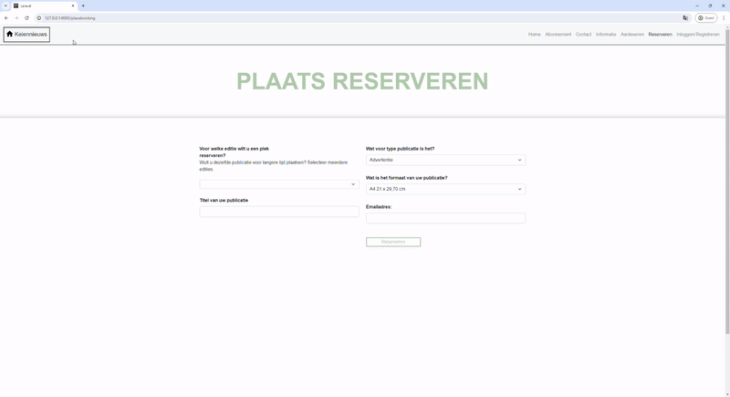
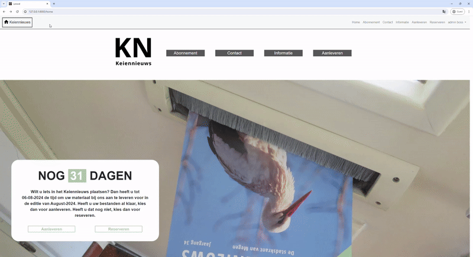

# Keiennieuws

Welcome to the official repository for Keiennieuws, a project dedicated to serving our local newspaper community. Keiennieuws is designed with the community in mind, offering a platform where individuals and businesses can engage directly with the newspaper in a dynamic and interactive way.

## Features

- **Reserve Advertising Space**: Users can reserve a spot in the magazine for their advertisements. This can be done in advance, and users have the flexibility to upload their content immediately or at a later time, ensuring their message reaches the community exactly when they need it to.

- **Community Contributions**: We encourage community members to contribute to Keiennieuws. Whether you're a budding photographer or a writer with a story to tell, you can submit your pictures or articles. Selected contributions may be featured in the magazine, showcasing the talents and insights of our community.

- **Volunteer and Support**: For those looking to get more involved, Keiennieuws offers opportunities to volunteer and support the newspaper. Sign up to help us continue to provide valuable content and services to our community.

- **Subscription Services**: Stay updated with the latest news and stories by subscribing to Keiennieuws. Subscribers can easily manage their subscription through the user panel, including the option to unsubscribe at any time.

- **User Panel**: Registered users have access to a personalized user panel. Here, you can update your personal information, view your uploaded content, track your reserved advertising spaces, and manage your subscription details.

- **Pricing and Information**: Detailed information about advertising rates, subscription fees, and other services can be found in the information tab. We strive to maintain transparency and ensure our community members can make informed decisions.

## Getting Involved

Keiennieuws is more than just a newspaper; it's a community platform. Whether you're looking to advertise, contribute content, or simply stay informed, we welcome you to join us. Together, we can keep our community connected and informed.

For more information on how to get involved or to explore our services, please visit the information tab or contact us directly through our website.

Thank you for supporting Keiennieuws, your local newspaper project.

## Examples
The whole website shown

